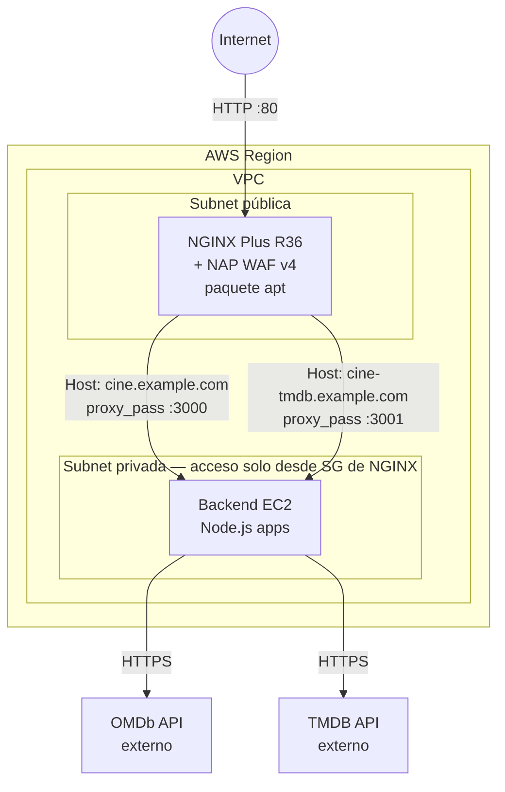
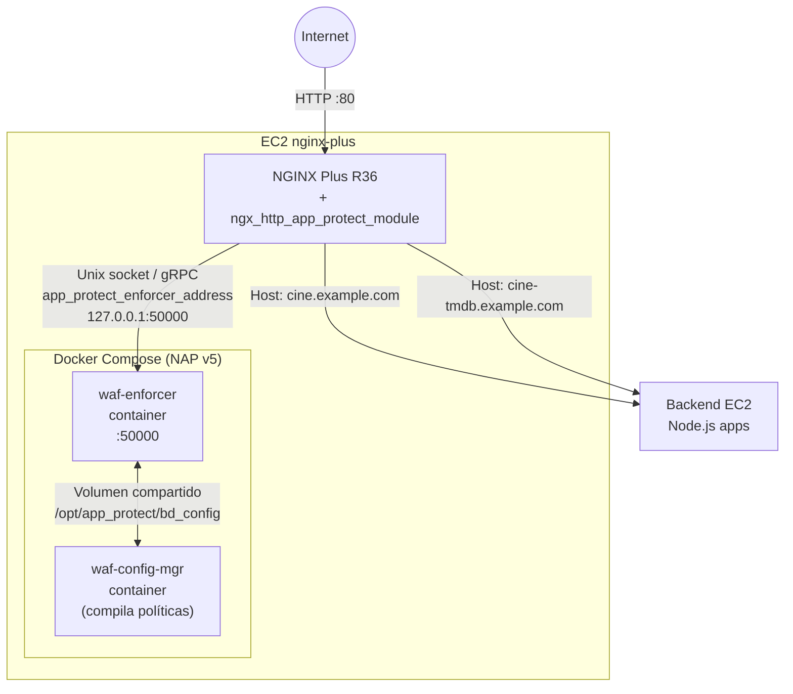
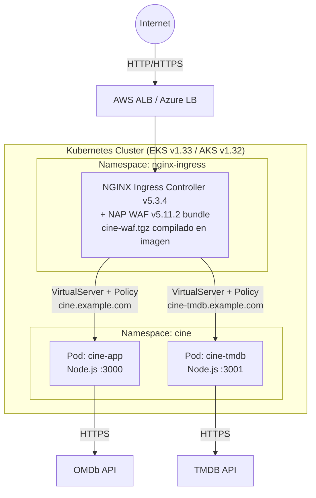
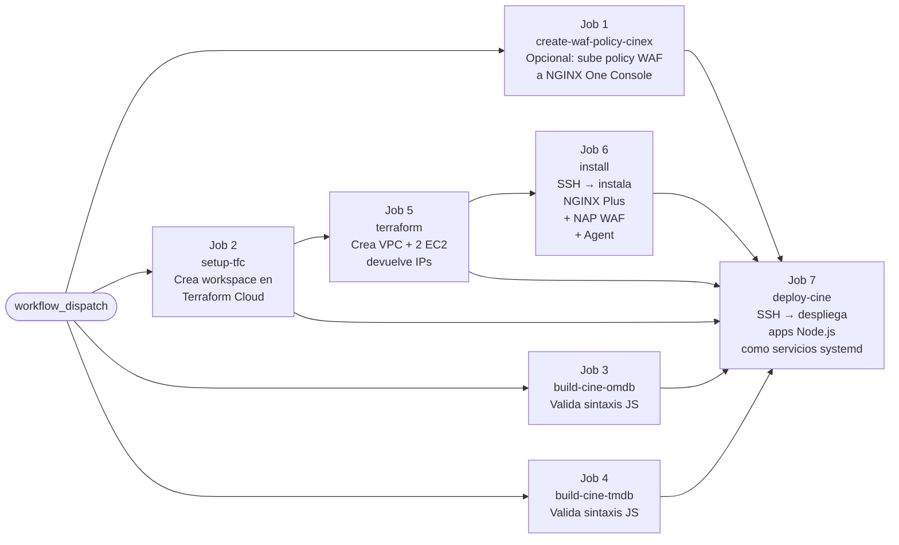
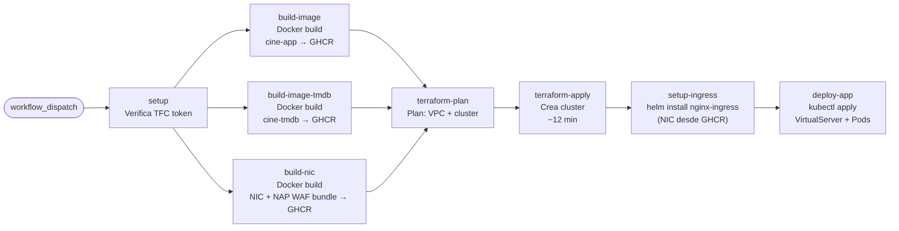
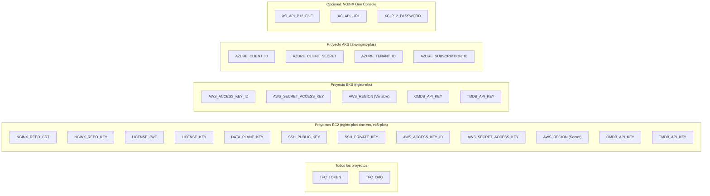

# Architecture Diagrams

---

## 1. Flujo de tráfico — EC2 con NAP WAF v4 (`nginx-plus-one-vm`)

---

## 2. Flujo de tráfico — EC2 con NAP WAF v5 hybrid (`ex5-plus`)

---

## 3. Flujo de tráfico — Kubernetes EKS/AKS con NAP WAF v5

---

## 4. Pipeline GitHub Actions — Deploy EC2

---

## 5. Pipeline GitHub Actions — Deploy Kubernetes (EKS/AKS)

---

## 6. Diagrama de secretos requeridos por proyecto

